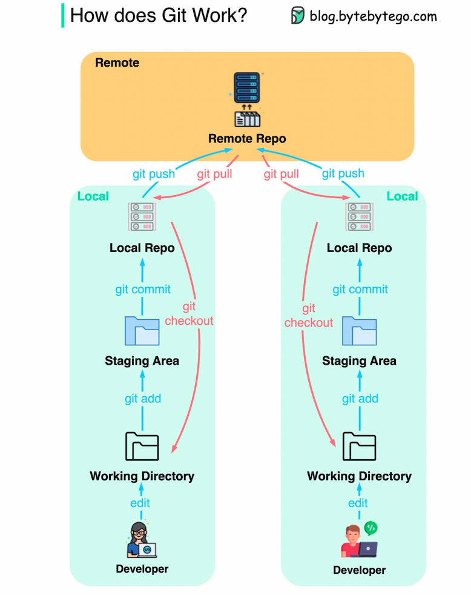

### 
- git help < git command like push or what ever you want to know >
- git init:   &nbsp;  Initializes a git repository by creating initial .git directory in a new or in an existing project.
- git clone: &nbsp; Copies an existing Github repo to local machine.
- git status: &nbsp; checks the working dorectory to see if up-to-date with the remote repo. 
- git add . : add all the changes to the staging area of the working directory. This is the first step in commiting changes to your local versions of the repo before pushing them to the remote GIthub version of the repo. 
- git commit -m "provide the commit message": &nbsp; Git records the changes made to yur version of the repo. 
- git push: &nbsp; pushes the local repo changes to the remote repo. To push the chnages you need username and classical token (no PW accepted now days)
- git pull:&nbsp; 
- git status: &nbsp;
- git branch: &nbsp; 
  
  
  <br />
  <br /> 

  
  ### `Git branch`
  Git branch allows you to work independent environment so that your changes don't affect other branches until you merge.

  ```  
    - git status
    - git branch <branch_name>
    - git branch -a
    - git push -u origin <branch_name>
    - git checkout <branch_name>
    - git status
    - echo "test >> test.sh
    - git status
    - git add test.sh
    - git commit -m "Test"
    - git push 
    - git chekout master
    - git branch -d <branch_name>
    - git push origin --delete <branch_name
  ```
 <br />
<p align = "center">

<figcaption align = "center">  Fig.1 - Best description of the git work flow. Picture credit goes to bytebytego.com </figcaption>


# MarkDown Tips and Tricks
###  `Headers:`
 - #H1, ## H2, ## H3, H4 ###, H5 ####, ......
_____________________________________________________________________
  ### `Space and paragraph change:`
- <br />  changes the paragraph
- &nbsp; add space between the words
________________________________________________________________________
### `Text Decorations:`  
- **bold**, *italic*, 
- ~~ StrikeThrough text ~~
________________________________________________________________________
### `Links:`  
- [My github](https://github.com/sumandhamala "Add description if you want")
- [Links](#headers "link to previous place in the documents")
- [Reference link]: https://www.youtube.com/watch?v=ftOBvusMHjQ
-  [My Github][Reference link] 
________________________________________________________________________  
### `Images:`
-  
________________________________________________________________________  
### `Unordered and Ordered List:` 
- `*` for unordered list while 1., 2., for ordered list

________________________________________________________________________
### `Code Blocks:`
```python (programming language name)
def Sum (self.a, self.b):
  returns self.a + self.b
```
Addition = print(Sum(1+2))
________________________________________________________________________
### `Inline code block:`
- `Suman`. 

________________________________________________________________________
### `Tables:`
-  Tables can be created with headings and text alignment options.

    |Stocks|Price|
    |:---:|:---:|
    |TSLA|230|
    |APPL|130|

    Tables        | Are           | Cool  |
    | ------------- |:-------------:| -----:|
    | col 3 is      | right-aligned | $1600 |
    | col 2 is      | centered      |   $12 |
    | zebra stripes | are neat      |    $1 |

    Markdown | Less | Pretty
    --- | --- | ---
    *Still* | `renders` | **nicely**
    1 | 2 | 3
   
_____________________________________________________________________

### ` Blockquotes:`
> This is an example of a blockquote
>> This is sub blockquote example.
________________________________________________________________________

### `Horizontal Rules:`
- Three or more ...
- Hyphens: ---
- Asterisks: ***
- Underscores: ___
  
  _______________________________________________________________________

### `Youtubes videos Link:`
- [](https://www.youtube.com/watch?v=ftOBvusMHjQ)
_________________________________________________________________________
### `Comments which does not render`
- [This is a hidden comments format.]: #
- <!-- This is commented out. Like the case in HTML. -->
_________________________________________________________________________
### `Callouts`
> :bulb: **Tip:** Here is an important tip to remember! ...
> 
> :smile: **Smile emoji:** Here is the smiling emoji.  ...
> 
> :blush: **BLush emoji:** Here is the blush emoji.
> 
> :cry:  **Cry emoji:** Here is the cry emoji.
________________________________________________________________________
### `Resources:`
  1) [Markdown cheatsheet](https://github.com/adam-p/markdown-here/wiki/Markdown-Cheatsheet#links)

2) [MarDown Notes](https://docs.github.com/en/get-started/writing-on-github/getting-started-with-writing-and-formatting-on-github/basic-writing-and-formatting-syntax)